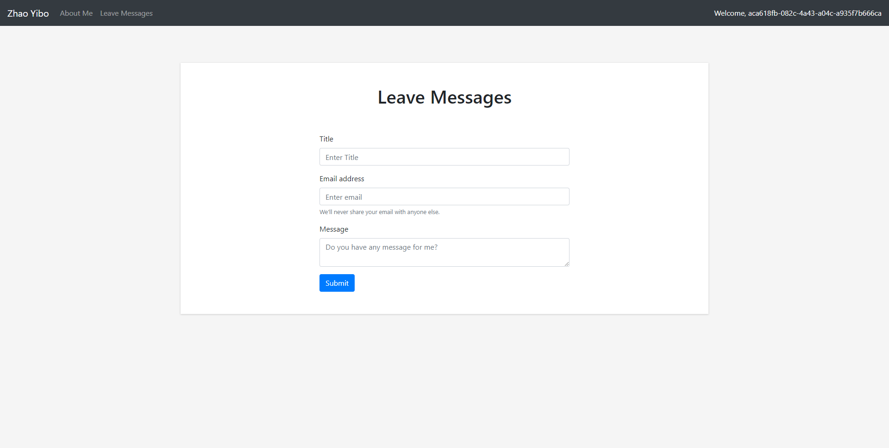

# Do you find cheat code?

##  Objectives
This project is a good practice to learn how to design and develop simple homepage by html, css and javascript. Besides that, 
I also add function of leaving message which requires support of server end program.

## Content
[My homepage](http://18.144.2.153:8080/) consists of following modules:
* index page
* detail information
  + self-introduction and contact information
  + education background
  + experiences
  + skill list
* leaving message (Only for login user)
* login

## Screenshots
index page


information page


message-page


## Video
https://youtu.be/LE0f75B7IH0

## Technology
During development, I utilized following libs, plugins and frameworks:
* [jQuery](https://jquery.com)
* [Bootstrap](https://getbootstrap.com/)
* [jQuery Cookie](https://github.com/carhartl/jquery-cookie)
* [AOS](https://github.com/michalsnik/aos)
* [Spring](https://spring.io/)

## Installation
install java (JDK 1.8 required)  
download jar
```shell
java -jar xxxx com.my.webdev.project.homepage.Server
```
visit website

## Course
[CS 5610 - Web Development](http://johnguerra.co/classes/webDevelopment_spring_2019/)